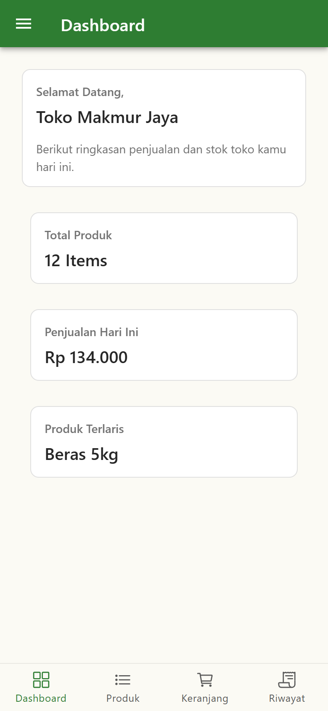
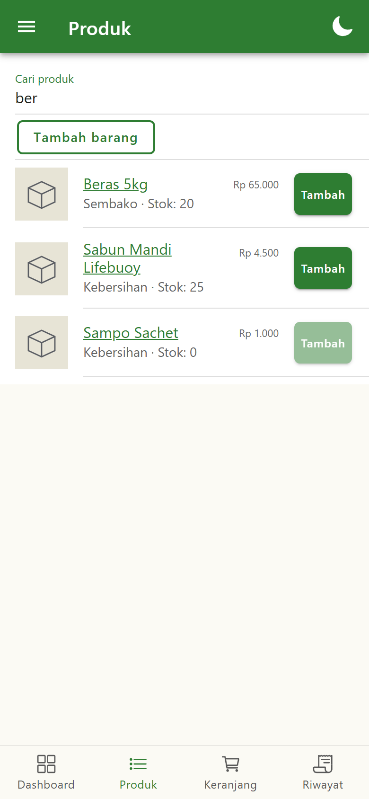
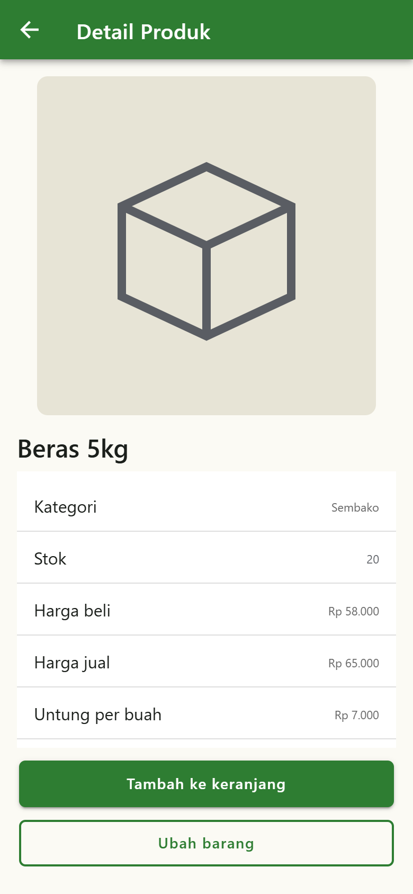
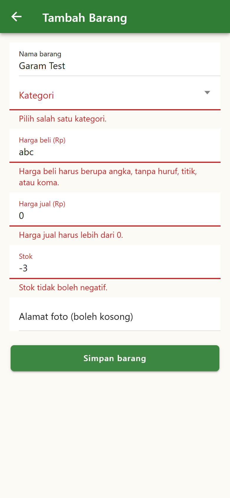
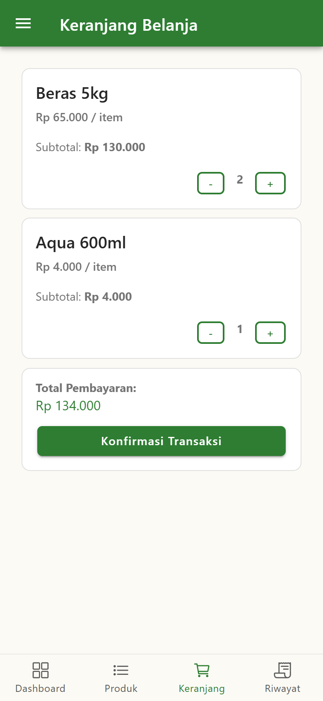
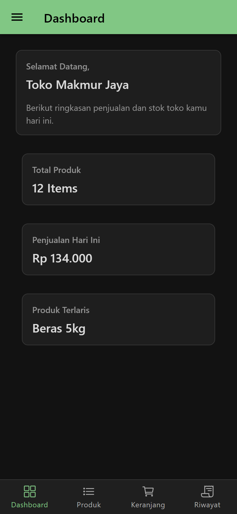
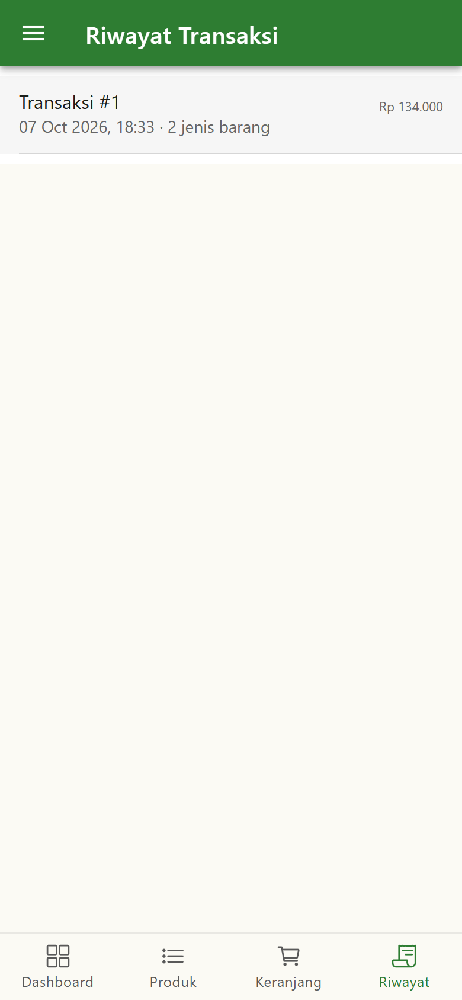

# SIMOBILE

Prototipe aplikasi kasir mobile untuk warung "Toko Makmur Jaya", dibuat dengan Ionic Angular. Pemilik warung bisa melihat ringkasan penjualan hari ini, mencari barang sambil mengetik, menambah dan mengubah data barang, lalu mencatat transaksi dari ponsel. Aplikasi tidak memakai koneksi internet.

Proyek ini dikerjakan untuk UTS mata kuliah Hybrid Mobile Programming, Universitas Surabaya (Gasal 2026/27), oleh tim empat orang dalam satu repo.

Seluruh data disimpan di dalam aplikasi (memori) dan kembali ke data awal saat halaman dimuat ulang. Tidak ada database maupun API.

## Tampilan

Tangkapan layar diambil dari aplikasi yang berjalan, lebar 390 px.

| Dashboard | Produk dan pencarian | Detail produk |
|---|---|---|
|  |  |  |

| Form dengan pesan error | Keranjang | Dashboard mode gelap |
|---|---|---|
|  |  |  |

| Riwayat transaksi |
|---|
|  |

## Fitur yang berhasil diimplementasikan

Status ditentukan dari hasil klik langsung di browser (Edge, lebar 390 px), baik lewat `npm start` maupun build produksi.

| No | Fitur | Status | Catatan |
|---|---|---|---|
| 1 | Navigasi Tab (4 tab) dalam Drawer (Pengaturan, Tentang Aplikasi, Logout) | Berfungsi | Tab: Dashboard, Produk, Keranjang, Riwayat. Logout mengosongkan keranjang dan kembali ke Dashboard, karena belum ada login |
| 2 | Dashboard: jumlah produk, transaksi hari ini, produk terlaris | Berfungsi | "Transaksi hari ini" ditafsirkan sebagai total rupiah transaksi hari ini. Dihitung di service, angkanya berubah setelah transaksi |
| 3 | Pencarian produk real-time dengan `ngModel` | Berfungsi | Mencari di nama dan kategori. Ada keadaan "Produk tidak ditemukan" |
| 4 | Detail produk lewat route parameter `:id` | Berfungsi | Menampilkan stok, harga beli, harga jual. Id yang tidak ada menampilkan pesan dan tombol kembali |
| 5 | Gambar default dan tombol tambah nonaktif saat stok 0 | Berfungsi | Gambar default berupa SVG di dalam kode. Klik "Tambah" tidak ikut membuka detail |
| 6 | Form tambah dan ubah produk (Reactive Form) dengan validasi per field | Berfungsi | Nama wajib, kategori wajib, harga bilangan bulat lebih dari 0, stok bilangan bulat tidak negatif, alamat foto boleh kosong. Isian yang sudah ada tidak hilang saat ada kesalahan |
| 7 | Logic data dipisah ke service | Berfungsi | 5 service: `ProductService`, `KeranjangService`, `TransactionService`, `TemaService`, `AnimasiService` |
| 8 | Tema hijau-kuning dan mode gelap/terang | Berfungsi | Tombol mode gelap ada di Pengaturan dan di header Produk |
| 9 | Animasi (3) | Berfungsi | Muncul bertahap di detail produk, getar pada kolom form yang salah, kartu keranjang muncul dari bawah. Terbukti terpanggil lewat Web Animations API. Gerakannya belum ditonton langsung di perangkat |
| 10 | Keranjang dan konfirmasi transaksi | Berfungsi | Total, ubah jumlah, tombol "Konfirmasi Transaksi" menyimpan ke riwayat, mengurangi stok, dan mengosongkan keranjang |
| 11 | Riwayat transaksi dan detailnya | Berfungsi | Daftar terbaru di atas, klik membuka rincian barang, jumlah, dan total |
| 12 | Data dummy | Berfungsi | 11 produk, harga Rp 1.000 sampai Rp 65.000, stok 0 sampai 100 (dua produk stok 0), 5 kategori |

### Batasan yang disengaja

- Data tidak disimpan permanen. Muat ulang halaman mengembalikan data awal dan mengosongkan riwayat.
- Menu Logout belum terhubung ke login karena belum ada autentikasi.
- Mode gelap tidak diingat. Aplikasi selalu mulai dalam mode terang.
- Belum diuji di perangkat Android atau iOS sungguhan.

## Teknologi

| Bagian | Versi |
|---|---|
| Ionic (`@ionic/angular`) | ^9.0.0 |
| Angular | 22.1.7 |
| TypeScript | ~6.0.0 |
| Node.js yang dipakai saat pengembangan | v24.21.0 |

## Instalasi

Syarat: Node.js dan npm, serta Git.

```bash
git clone https://github.com/abbyshawty/HMP-Saya-Akan-Lawan-.git
cd HMP-Saya-Akan-Lawan-/project_uts
npm install
```

## Menjalankan

```bash
npm start
```

Buka http://localhost:4200 di browser. Untuk tampilan ponsel, buka DevTools, aktifkan mode perangkat (Ctrl+Shift+M di Chrome), dan pilih lebar sekitar 390 px.

Build produksi (hasilnya masuk ke folder `www`):

```bash
npm run build
```

## Struktur proyek

Semua perintah npm dijalankan dari folder `project_uts`.

```text
project_uts/src/
  app/
    tabs/               halaman Tab dengan 4 tombol tab
    dashboard/          tab Dashboard
    produk/             tab Produk: daftar dan pencarian
    cart/               tab Keranjang
    transaksi/          tab Riwayat: daftar transaksi
    produk-detail/      detail produk (rute produk/:id)
    produk-form/        form tambah dan ubah produk
    transaksi-detail/   detail transaksi (rute transaksi/:id)
    pengaturan/         Pengaturan: tombol mode gelap
    tentang/            Tentang Aplikasi
    services/           service data, tema, dan animasi
    shared/             format rupiah, gambar default, validator form
  theme/variables.scss  palet warna terang dan gelap
  global.scss           gaya global
```

Penjelasan arsitektur dan alur data ada di [docs/arsitektur.md](docs/arsitektur.md).

## Keputusan desain

- **Tema:** hijau `#2E7D32` sebagai warna utama dan kuning `#F4B400` sebagai aksen (secondary dan warning, juga garis fokus keyboard di mode gelap). Merah `#C62828` hanya untuk pesan salah dan stok habis. Pasangan warna teks dan latar yang utama sudah dihitung rasio kontrasnya, semuanya di atas 4,5 : 1 di mode terang dan gelap.
- **Mode gelap:** `TemaService` menambah kelas `ion-palette-dark` pada elemen `html`. Kelas itu menimpa variabel warna di `variables.scss` dan mengaktifkan palet gelap bawaan Ionic.
- **Animasi:** muncul bertahap di detail produk supaya mata mengikuti urutan isi, getar pada kolom form yang salah supaya mata tertarik ke kolom itu, kartu keranjang muncul dari bawah saat tab dibuka. Semuanya dilewati kalau pengguna mengaktifkan `prefers-reduced-motion`.
- **Form:** harga dan stok memakai input teks, bukan `type="number"`, supaya huruf yang diketik tetap terbaca validator dan mendapat pesan, bukan dibuang diam-diam. Saat simpan gagal, form tidak dikosongkan dan semua kolom yang salah diberi pesan.

## Tim

| Anggota | Akun GitHub | NRP | Bagian |
|---|---|---|---|
| Michael | Freakdih | [ISI: NRP] | Struktur navigasi, pencarian produk, riwayat transaksi |
| Nadya | s160424202-star | [ISI: NRP] | Dashboard, keranjang dan checkout |
| Velyn | Fellina-Ivanka | [ISI: NRP] | Detail produk, form tambah dan ubah, animasi |
| Abby | abbyshawty | [ISI: NRP] | Property dan event binding, Angular service, tema dan mode gelap |

Aturan kerja tim ada di [docs/kontribusi.md](docs/kontribusi.md).

## Rencana UAS

- Penyimpanan data permanen dan akses lewat API (menggantikan data di dalam aplikasi).
- Autentikasi untuk menu Logout.
