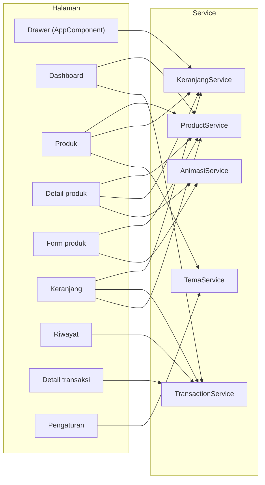
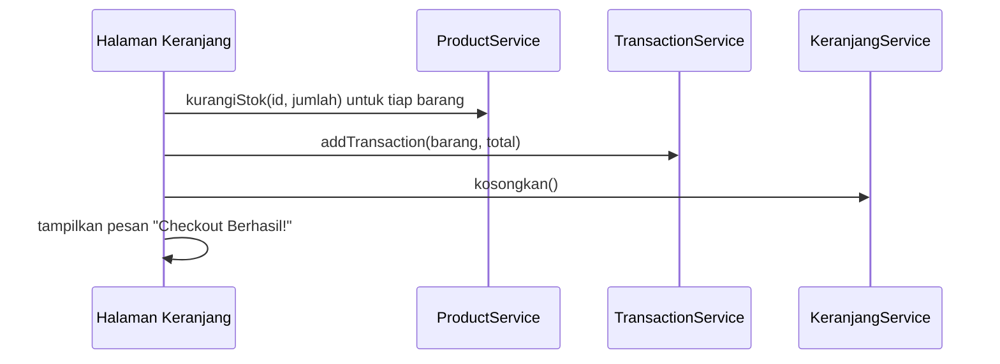

# Arsitektur

Aplikasi memakai Ionic Angular dengan NgModule. Tiap halaman punya modul dan rute sendiri yang dimuat saat dibutuhkan (lazy loading). Aturan utamanya: **halaman hanya menampilkan data dan menangkap aksi pengguna, semua pengelolaan data ada di service.**

Aplikasi berjalan tanpa `zone.js`. Karena itu halaman di dalam Tab memanggil `detectChanges()` pada `ionViewWillEnter()` supaya tampilan ikut berubah saat tab dibuka lagi.

## Halaman dan service

Panah menunjukkan komponen yang meng-inject service lewat constructor.

Semua service ada di `project_uts/src/app/services/` dan memakai `providedIn: 'root'`.

| Service | Tanggung jawab |
|---|---|
| `ProductService` | Menyimpan daftar produk dan kategori, mencari, menambah, mengubah, dan mengurangi stok. |
| `KeranjangService` | Menyimpan isi keranjang, menjaga jumlah tidak melebihi stok, dan menghitung total dan jumlah barang. |
| `TransactionService` | Menyimpan riwayat transaksi, menghitung total penjualan hari ini, dan menentukan produk terlaris. |
| `TemaService` | Menyimpan status mode gelap dan memasang atau melepas kelas `ion-palette-dark` pada elemen `html`. |
| `AnimasiService` | Membungkus `AnimationController` untuk animasi muncul bertahap, getar, dan membesar, dan melewatinya bila `prefers-reduced-motion` aktif. |

Berkas bersama di `project_uts/src/app/shared/`: `format.ts` (format rupiah dan gambar default) dan `validators.ts` (aturan validasi form).

## Navigasi

Rute dibagi dua. Halaman utama berada di dalam halaman Tab (`tabs/tabs-routing.module.ts`), halaman lain berdiri sendiri di `app-routing.module.ts`. `AppComponent` membungkus semuanya dengan `ion-menu` (Drawer) berisi Pengaturan, Tentang Aplikasi, dan Logout. Setiap halaman Tab punya `ion-menu-button` untuk membuka Drawer, dan Pengaturan serta Tentang Aplikasi punya tombol kembali.

| Alamat | Halaman | Di dalam Tab |
|---|---|---|
| `/` dan alamat yang tidak dikenal | diarahkan ke `/dashboard` | - |
| `/dashboard` | Dashboard | ya |
| `/produk` | Daftar produk dan pencarian | ya |
| `/cart` | Keranjang | ya |
| `/transaksi` | Riwayat transaksi | ya |
| `/produk/:id` | Detail produk | tidak |
| `/produk-form` | Form tambah produk | tidak |
| `/produk-form/:id` | Form ubah produk | tidak |
| `/transaksi/:id` | Detail transaksi | tidak |
| `/pengaturan` | Pengaturan | tidak |
| `/tentang` | Tentang Aplikasi | tidak |

Id yang tidak ada (misalnya `/produk/999`) menampilkan pesan "tidak ditemukan" dengan tombol kembali.

## Alur checkout

Urutan di bawah mengikuti `cart.page.ts`, tombol "Konfirmasi Transaksi".

Transaksi lalu muncul di tab Riwayat, dan Dashboard menghitung ulang penjualan hari ini serta produk terlaris dari `TransactionService`.

## Tema dan mode gelap

Palet warna ada di `project_uts/src/theme/variables.scss`: variabel Ionic untuk mode terang di `:root`, dan penimpaan untuk mode gelap di bawah kelas `.ion-palette-dark`. `project_uts/src/global.scss` mengimpor `dark.class.css` bawaan Ionic dan menambah gaya global (bar atas, tombol, kartu, garis fokus keyboard).

Mode gelap diaktifkan oleh `TemaService.atur()`, yang menambah atau melepas kelas `ion-palette-dark` pada elemen `html`. Tombolnya ada di halaman Pengaturan dan di header halaman Produk. Mode gelap tidak diingat antar sesi.

## Data dummy

Data awal ada di `project_uts/src/app/services/product.service.ts`: 11 produk dalam 5 kategori (Sembako, Makanan, Minuman, Kebersihan, Lainnya). Harga jual dari Rp 1.000 sampai Rp 65.000, stok dari 0 sampai 100, dan dua produk berstok 0 (Gula Pasir 1kg dan Sampo Sachet). Semua produk tanpa alamat foto, jadi memakai gambar default.
